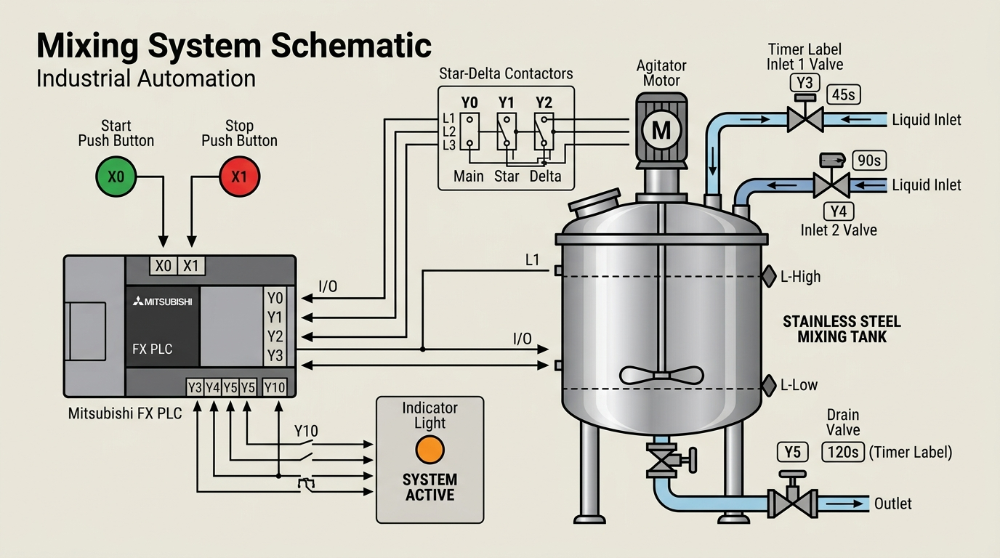
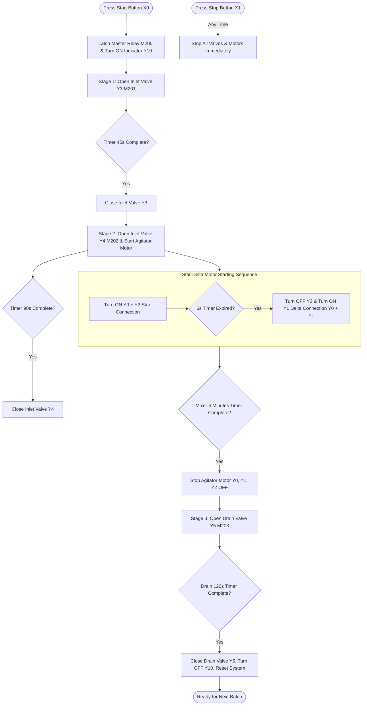

# 🧪 PLC Liquid Mixing Automation System

[](https://www.mitsubishielectric.com/)
[](https://www.mitsubishielectric.com/)
[-orange.svg)]()
[]()

An industrial automated **Batch Liquid Mixing Control System** programmed in **Ladder Logic (LD)** for **Mitsubishi FX Series PLCs** (developed in GX Works2). 

This system controls a multi-stage liquid filling process, Star-Delta agitator motor mixing sequence, and automated tank draining with precise timed controls and safety interlocks.

---

## 📌 System Schematic & Process Layout



---

## ⚙️ Key Features

- **Multi-Stage Automatic Batch Filling**: Sequential filling of two distinct liquid ingredients (`Liquid 1 - Y3` and `Liquid 2 - Y4`).
- **Star-Delta Motor Starter Control**: Reduced-voltage starting sequence for the agitator motor (`Y0 + Y2` Star mode for 6s switchover to `Y0 + Y1` Delta mode) to minimize inrush current.
- **Automated Timed Control**:
  - **Inlet Valve 1 (Y3)**: Fills for 45 Seconds
  - **Inlet Valve 2 (Y4)**: Fills for 90 Seconds
  - **Agitator Motor (Y0 + Y1)**: Mixes for 4 Minutes
  - **Drain Valve (Y5)**: Drains for 120 Seconds (2 Minutes)
- **Status Indicator Lamp (Y10)**: Provides visual system operation status.
- **Safety & Stop Interlocks**: Start push button (`X0`) latching circuit with immediate Emergency/Normal Stop (`X1`) control.

---

## 📋 I/O & Bit Allocation Table

### 📥 Physical Inputs (X)
| Address | Signal Name | Device Type | Function Description |
| :---: | :--- | :--- | :--- |
| **X0** | Start Button | Push Button (NO) | Initiates the automatic liquid mixing sequence |
| **X1** | Stop Button | Push Button (NC/NO) | Stops system operation immediately |

### 📤 Physical Outputs (Y)
| Address | Output Device | Component | Function Description |
| :---: | :--- | :--- | :--- |
| **Y0** | Agitator Main Contactor | Motor Contactor (KM1) | Main power contactor for Agitator Motor |
| **Y1** | Agitator Delta Contactor | Motor Contactor (KM2) | Full-voltage running contactor (**Y0 + Y1 = Delta Run**) |
| **Y2** | Agitator Star Contactor | Motor Contactor (KM3) | Reduced-voltage starting contactor (**Y0 + Y2 = Star Start**) |
| **Y3** | Inlet Valve 1 | Solenoid Valve | Controls Liquid 1 filling into mixing tank (45s) |
| **Y4** | Inlet Valve 2 | Solenoid Valve | Controls Liquid 2 filling into mixing tank (90s) |
| **Y5** | Drain Valve | Solenoid Valve | Controls tank bottom drainage (120s) |
| **Y10** | System Running Indicator | Pilot Lamp | Illuminates when mixing sequence is active |

### 🧠 Auxiliary Internal Relays (M)
| Address | Internal Flag Name | Sequence Stage & Purpose |
| :---: | :--- | :--- |
| **M200** | Master Control Relay | Main process latch / system run flag |
| **M201** | Stage 1 Control Bit | Liquid 1 inlet stage (`Y3` active for 45s) |
| **M202** | Stage 2 Control Bit | Liquid 2 inlet stage (`Y4` active for 90s) & Agitator motor active (4 min) |
| **M203** | Stage 3 Control Bit | Tank draining stage (`Y5` active for 120s) |

---

## ⏱️ Timing Specifications

| Process Stage | Output / Device | Timer Duration | Description |
| :--- | :---: | :---: | :--- |
| **Star-to-Delta Transition** | Y0 + Y2 ➔ Y0 + Y1 | **6 Seconds** | Delay before switching agitator motor from Star to Delta |
| **Liquid 1 Filling** | Inlet Valve 1 (Y3) | **45 Seconds** | Fills Liquid 1 into tank |
| **Liquid 2 Filling** | Inlet Valve 2 (Y4) | **90 Seconds** | Fills Liquid 2 into tank |
| **Agitator Mixing** | Mixer Motor (Y0 + Y1) | **4 Minutes (240s)** | Thoroughly mixes liquids A & B |
| **Tank Drainage** | Drain Valve (Y5) | **120 Seconds (2 min)** | Completely empties tank ready for next cycle |

---

## 🔄 Sequence of Operation



---

## ⚡ Star-Delta Motor Starter Logic

1. **Star Starting Phase**: Outputs `Y0` (Main) and `Y2` (Star) energize simultaneously to start the agitator motor in a Star configuration, limiting initial inrush current.
2. **Transition**: After **6 seconds**, the Star contactor (`Y2`) opens.
3. **Delta Running Phase**: The Delta contactor (`Y1`) closes with `Y0` (Main), keeping `Y0 + Y1` active for full torque during the **4-minute mixing cycle**.

---

## 📁 Repository Structure

```
.
├── LOS.gxw             # Mitsubishi GX Works2 PLC Project File (Ladder Program)
├── system_diagram.jpg  # System Visual Architecture Diagram
└── README.md           # Complete Project Documentation
```

---

## 🚀 Opening the Project in GX Works2

1. Launch **Mitsubishi GX Works2**.
2. Navigate to `File` ➔ `Open Project...`
3. Select `LOS.gxw` and click **Open**.
4. Set PLC Series to **FXCPU** (e.g. FX3U / FX3G / FX2N).
5. Use **GX Simulator2** (`Debug` ➔ `Start/Stop Simulation`) to test and simulate ladder logic execution without hardware.

---

## 📜 License & Contribution

This project is created for industrial automation study, PLC programming demonstration, and practical ladder logic reference. Feel free to star ⭐ the repository and use it as a project template!
